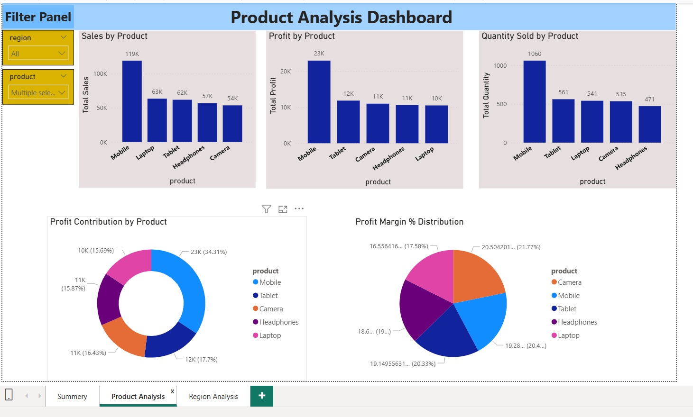
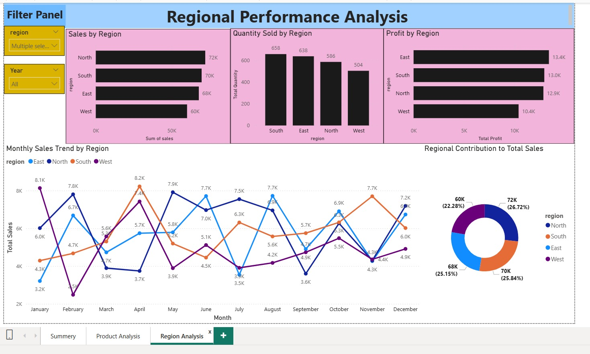

## 📊 Power BI Dashboard

### Executive Summary


---

### Product Analysis



---

### Region Analysis



# 📊 Sales Data EDA & Forecast Automation Project

## 📌 Project Overview

This project is an **end-to-end automated sales data analysis pipeline** built using Python.
It performs **data cleaning, exploratory data analysis (EDA), statistical analysis, trend analysis, forecasting, and automated PDF reporting**.

The main objective of this project is to **transform messy raw sales data into meaningful business insights and visual reports** that help decision-making.

---

# 🎯 Project Objectives

* Automate sales data cleaning
* Perform exploratory data analysis (EDA)
* Generate statistical insights
* Detect outliers and trends
* Forecast future sales
* Create automated PDF business reports
* Build Power BI dashboard for visualization

---

# 🧰 Tools & Technologies Used

* Python
* Pandas
* NumPy
* Matplotlib
* Seaborn
* ReportLab
* Scikit-learn
* Jupyter Notebook
* Power BI (Dashboard)
* GitHub (Version Control)

---

# 📁 Project Structure

```
Sales-Data-EDA-Automation/

│
├── notebooks/
│   ├── 01_data_cleaning.ipynb
│   ├── 02_eda_analysis.ipynb
│   ├── 03_statistical_analysis.ipynb
│   ├── 04_dashboard_export.ipynb
│
├── scripts/
│   ├── data_cleaning.py
│   ├── eda.py
│   ├── sales_analysis.py
│   ├── report_generator.py
│   ├── utils.py
│
├── data/
│   ├── raw/
│   ├── cleaned/
│   ├── processed/
│
├── reports/
│   ├── FINAL_REPORT.pdf
│   ├── kpi_summary.csv
│   ├── summary_report.csv
│   ├── outliers_report.csv
│   ├── order_id_distribution.png
│   ├── sales_distribution.png
│   ├── profit_distribution.png
│   ├── quantity_distribution.png
│   ├── region_sales.png
│   ├── trend_analysis.png
│   ├── sales_forecast.png
│   ├── correlation.png
│
├── dashboard/
│   ├── sales_dashboard.pbix
│   ├── dashboard_page1.png
│   ├── dashboard_page2.png
│
├── requirements.txt
├── README.md
└── main.py
```

---

# 🔄 Workflow Pipeline

Raw Data → Data Cleaning → EDA → Statistical Analysis → Forecasting → PDF Report → Power BI Dashboard

---

# 🧹 Data Cleaning Features

The cleaning module performs:

* Remove duplicate records
* Handle missing values (NaN)
* Standardize column names
* Fix inconsistent date formats
* Trim text values
* Handle outliers
* Convert data types properly

Output:

```
cleaned_sales_data.csv
```

---

# 📊 Exploratory Data Analysis (EDA)

EDA helps understand business performance through visualizations:

Generated Reports:

* Sales Trend Analysis
* Region-wise Sales
* Top Product Analysis
* Correlation Heatmap
* Summary Statistics Report

---

# 📈 Statistical Analysis Features

The statistical module generates:

* KPI Summary
* Sales Distribution
* Profit Distribution
* Quantity Distribution
* Outlier Detection
* Trend Analysis
* Sales Forecasting

---

# 📌 Key Performance Indicators (KPIs)

The project calculates:

* Total Sales
* Total Profit
* Profit Margin (%)
* Average Order Value
* Average Quantity

These metrics help evaluate **overall business performance**.

---

# 🔮 Sales Forecasting

Sales forecasting is performed using:

**Moving Average Method**

Features:

* Monthly Sales Aggregation
* Trend Smoothing
* Future Sales Prediction

This helps in:

* Inventory Planning
* Demand Forecasting
* Business Planning

---

# 📄 Automated PDF Reporting

The system generates:

```
FINAL_REPORT.pdf
```

Which includes:

* Executive Summary
* KPI Summary
* Statistical Insights
* Trend Analysis
* Forecast Visualizations
* Business Recommendations

This makes reporting **fully automated**.

---

# 📊 Power BI Dashboard

The dashboard visualizes:

* Sales KPIs
* Sales Trends
* Profit Analysis
* Regional Performance
* Forecast Insights

Dashboard outputs are stored in:

```
dashboard/
```

---

# 🚀 How to Run This Project

## Step 1 — Install Dependencies

```bash
pip install -r requirements.txt
```

---

## Step 2 — Run Data Cleaning

```bash
python main.py
```

This will:

* Clean raw data
* Generate analysis
* Create reports
* Produce final PDF

---

# 📊 Sample Outputs

Generated outputs include:

* KPI Summary Table
* Distribution Charts
* Forecast Visualizations
* Correlation Heatmap
* Final PDF Report

All reports are stored in:

```
reports/
```

---

# 📌 Business Value of This Project

This project demonstrates:

* Data Cleaning Automation
* Exploratory Data Analysis
* Statistical Thinking
* Business Insight Generation
* Forecast Modeling
* Report Automation

These are **core skills required for Data Analyst roles**.

---

# 🎯 Future Enhancements

Possible improvements:

* ARIMA Forecasting
* Machine Learning Models
* Interactive Dashboard
* Real-time Data Pipeline
* Advanced Statistical Modeling

---

# 👤 Author

**Name:** (Debolina Sorkhel)
**Role:** Data Analyst Enthusiast
**Project Type:** End-to-End Sales Data Analysis Automation

---
